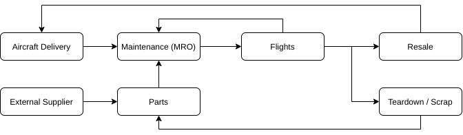
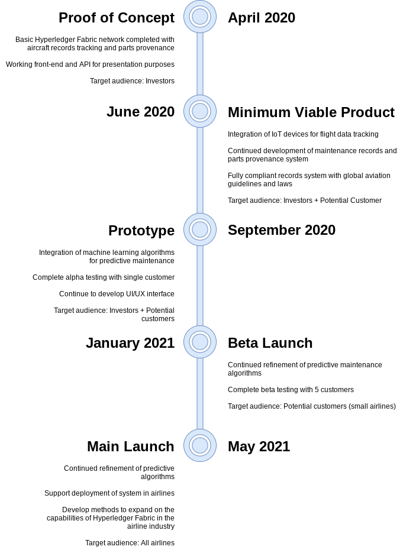

# Plateforme de suivi des avions

* Application distribu�e d�velopp�e dont l'objectif est de mettre en place une plateforme de tracabilit� des avions et leur maintance et ceci en utilisant la technologie hyperledgerFabric
* Equipe : Souheil Ben Slama - Mohamed Aziz Ammari - Marouane Mahou - Chaima Ben Ghanem - Amal Abidi
* GL5

## Description

L'industrie a�rospatiale poss�de une cha�ne d'approvisionnement vaste et complexe impliquant des centaines, voire des milliers d'entreprises et des millions de pi�ces. L'ensemble de la cha�ne d'approvisionnement doit respecter des r�glementations et des proc�dures sp�cifiques sp�cifi�es par les organes directeurs des gouvernements et d'autres organisations. Les nombreuses facettes de la cha�ne d'approvisionnement peuvent �tre observ�es dans les diff�rentes phases de d�veloppement et de d�ploiement des a�ronefs - approvisionnement en pi�ces, assemblage des a�ronefs, certification, livraison, maintenance et fin de vie.

Ce projet ne cherche pas � fournir une solution globale pour l'ensemble de la cha�ne d'approvisionnement a�rospatiale, mais plut�t une solution cibl�e pour les compagnies a�riennes et le cycle de maintenance, de r�paration et de r�vision (MRO) requis pour les avions achet�s. L'objectif est de num�riser les dossiers de maintenance et de provenance des pi�ces de mani�re � accro�tre la confiance lors de la vente de l'avion, � �conomiser de l'argent gr�ce � un processus plus rationalis� et, surtout, � accro�tre la s�curit� du transport a�rien.

La solution propos�e esp�re r�soudre le probl�me le plus paradoxal de la cha�ne d'approvisionnement : comment augmenter la fiabilit�, la s�curit� et la qualit� tout en diminuant les co�ts.

### Background

Pour une compagnie a�rienne typique comme Air Canada, Delta, KLM, etc., un avion suit le cycle illustr� dans la figure ci-dessous�: 
  
L'avion est livr� et le cycle de maintenance et de vols se d�roule jusqu'� ce qu'il soit d�termin� qu'il sera vendu ou mis au rebut. Au cours des proc�dures MRO, les pi�ces peuvent �tre fournies comme neuves par des fournisseurs externes ou elles peuvent �tre r�cup�r�es � partir d'un avion mis au rebut. Ces pi�ces sont encore utilisables car elles n'ont pas d�pass� leur seuil d'heures de vol.

Le probl�me est que les dossiers de maintenance sont souvent encore suivis sur papier, et le dossier d'un avion peut �tre constitu� de classeurs remplis de diverses informations. De plus, les pi�ces qui ont �t� utilis�es dans d'autres a�ronefs peuvent ne pas avoir la bonne provenance et manquer d'informations critiques concernant leur dur�e de vie. Dans l'ensemble, les informations sont plus difficiles � trouver et � suivre, ce qui met la vie des clients en jeu et introduit des inefficacit�s dans un plan d'horaires de vol tr�s soigneusement optimis�.

### Solution Architecture

La solution propos�e exploite la technologie blockchain via Hyperledger Fabric pour le suivi et le partage d'informations au sein d'une compagnie a�rienne et avec d'autres compagnies a�riennes lorsqu'un avion doit �tre vendu. Les enregistrements de maintenance et de provenance des pi�ces peuvent �tre facilement stock�s sur le r�seau blockchain par les fournisseurs MRO via des mises � jour manuelles et l'int�gration d'appareils IoT.

Les appareils Internet des objets (IoT) permettent de g�n�rer automatiquement des enregistrements de vol pour l'avion et ses pi�ces associ�es. Les appareils peuvent suivre la temp�rature et l'acc�l�ration pour suivre les diverses contraintes et conditions et noter si des conditions anormales ont �t� rencontr�es. Ces informations seraient stock�es sur la blockchain pour fournir un enregistrement immuable de l'historique d'un avion ou d'une pi�ce.

Cependant, les appareils IoT fournissent souvent d'�normes quantit�s d'informations et l'analyse des informations pour les mod�les dangereux est difficile. En plus de la blockchain et de la technologie IoT, la solution propos�e comprendrait un algorithme d'apprentissage automatique pour la maintenance pr�dictive. En acc�dant aux dossiers de maintenance et aux donn�es IoT de plusieurs a�ronefs, l'algorithme serait en mesure d'alerter les responsables de la maintenance des probl�mes �ventuels ou des tendances notables de l'�tat des a�ronefs.
### Timeline/Implementation

## Technical Details (PoC)

La section traite des param�tres techniques utilis�s dans Hyperledger Fabric, l'API Expresss et le frontal React.

### Architecture

**Hyperledger Fabric**  
Blockchain en tant que backend o� les informations sur les avions et les pi�ces peuvent �tre stock�es selon les donn�es et les param�tres sp�cifi�s ci-dessous. L'impl�mentation actuelle n'utilise qu'un seul channel, utilisateur et administrateur pour la preuve de concept. Les futures impl�mentations utiliseraient diff�rents canaux, utilisateurs, administrateurs et stockage de donn�es priv�es en fonction de l'�chelle et du nombre d'entreprises.

**Express API**  
Express.js est utilis� comme API pour se connecter � une instance bas�e sur le cloud de Hyperledger Fabric. Dans ce cas, l'instance est bas�e sur une machine virtuelle Google Cloud. La future impl�mentation inclurait plusieurs API r�parties sur diff�rents nSuds/clients. De plus, l'instance bas�e sur le cloud serait tr�s probablement d�plac�e d'une machine virtuelle vers un cluster kubernetes bas� sur le cloud.

**React**  
React est le front-end de d�monstration pour un point de connexion unique pendant la phase PoC. De plus, le site doit �tre adapt� aux mobiles pour que les responsables puissent l'utiliser facilement au travail sans avoir besoin d'un gros appareil. � l'avenir, les entreprises pourraient cr�er leurs propres applications frontales pour s'interfacer avec diff�rents points de terminaison API.

### Mod�lisation

Le diagramme suivant montre les 5 diff�rents types d'interactions pour le PoC.

1. L'administrateur de la compagnie a�rienne embarque un nouvel avion du fabricant.
1. Le responsable de la maintenance demande des informations sur l'avion apr�s un vol et avant la maintenance.
1. Le responsable de la maintenance soumet les informations de maintenance de l'a�ronef avant un vol.
1. L'administrateur demande des informations sur l'ensemble de la flotte.
1. L'administrateur vend ou met au rebut l'avion.

_Remarque�: les appareils IoT et la maintenance pr�dictive ne sont pas impl�ment�s dans PoC_

Des �l�ments de mod�lisation suppl�mentaires peuvent �tre trouv�s dans le dossier "documentation":

- [User stories](./documentation/userStories.md)
- [Diagramme de classes ](./documentation/classDiagram.png)

### Data/Parameters

_Stored in Hyperledger Fabric_

**Aircraft Object**

| Parameter             | Type                                                                                         | Description                                                                                                                                                                                           |
| --------------------- | -------------------------------------------------------------------------------------------- | ----------------------------------------------------------------------------------------------------------------------------------------------------------------------------------------------------- |
| `description`         | `{string aircraft, string tailNumber}`                                                       | Pour id�ntifier l'avion sp�cifique                                                                                                                                                               |
| `maintenanceSchedule` | `[{string type, number lastCompletedDate, number lastCompletedHours, number maxHours}, ...]` | Un tableau qui suit l'�tat actuel des maintenances                                                                                                                     |
| `partsList`           | `[string partID, ...]`                                                                       | Un tableau qui suit les parties qui sont actuellement dans l'avion                                                                                                                 |
| `flightHours`         | `number`                                                                                     | Num�ro de suivi des heures totales pour l'avion                                                                                                                                         |
| `owner`               | `[{string company, number purchaseDate, number soldDate}, ...]`                              | Un tableau suivant l'historique d'achat des avions                                                                                                                         |
| `maintainers`         | `[string username, ...]`                                                                     |Un tableau qui contient la liste des teneurs de l'avion (qui ont le droit de modifier les informations de maintenance pour les avions                                                                                                           |
| `maintenanceReports`  | `[{number date, string type, string notes, object partsReplaced}, ...]`                      | Un tableau contenant les diff�rents rapports d'inspection

**Part Object**

| Parameter      | Type                                                                      | Description                                                                                                        |
| -------------- | ------------------------------------------------------------------------- | ------------------------------------------------------------------------------------------------------------------ |
| `description`  | `{string id, string name}`                                                | Le num�ro fait r�f�rence au num�ro de pi�ce g�n�ral, en particulier pour les pi�ces rempla�ables, le nom est un nom �crit de la pi�ce |
| `totalHours`   | `number`                                                                  | Suivi du nombre total d'heures de vol pour la pi�ce                                                            |
| `maximumHours` | `number`                                                                  | Heures de vol maximum pour la partie                                                                                 |
| `history`      | `[{string tailNumber, number hours, number onDate, number offDate}, ...]` | Tableau montrant l'historique de la pi�ce, le dernier index est le plus r�cent                                               |

**User Object**

| Parameter  | Type                | Description                                                                                          |
| ---------- | ------------------- | ---------------------------------------------------------------------------------------------------- |
| `username` | `string`            | nom d'utilisateur stock�                                                                                  |
| `password` | `string`            | Mot de passe hash�                                                                                    |
| `type`     | `string`            | Peut �tre un admin ou un mainteneur                                                                    |
| `company`  | `string`            | La compagnie que l'utilisateur                                                                 |
| `aircraft` | `[tailNumber, ...]` | Un tableau de tailNumber que l'utilisateur 

### Functions

_Functions for managing data and interacting with data from outside Hyperledger_

**Chaincode Functions**

| Function Name        | Input                                                                      | Output              | Restricted                  | Details                                                                                                                                     |
| -------------------- | -------------------------------------------------------------------------- | ------------------- | --------------------------- | ------------------------------------------------------------------------------------------------------------------------------------------- |
| `registerUser`       | string `username`, string `password`, string `type`, string `company`      | bool `success`      | Admin + Maintainer          | Cr�e un profil d'utilisateur pour l'administrateur ou le responsable, le nom d'utilisateur et le mot de passe hach�s sont stock�s dans la blockchain, �choue si le nom d'utilisateur existe d�j� |
| `checkUser`          | string `username`, string `password`, string `type`, string `company`      | object `user`       | Admin + Maintainer          | V�rifie le nom d'utilisateur et le mot de passe par rapport aux informations de la blockchain et renvoie un bool�en                                                     |
| `registerAircraft`   | string `aircraft`, string `tailNumber`, string `company`                   | string `tailNumber` | Admin                       | Enregistrez un nouvel avion et cr�ez l'objet avion                                                                              |
| `assignAircraft`     | string `username`, string `tailNumber`, string `company`                   | bool `success`      | Admin                       | Affectez le mainteneur � l'avion afin qu'il ait acc�s aux donn�es                                                                 |
| `getAircraft`        | string `tailNumber`                                                        | object `aircraft`   | Admin + Assigned Maintainer | Obtient toutes les informations pour un avion sp�cifique dans le format d�crit ci-dessus                                                         |
| `newPart`            | object `part`                                                              | string `partID`     | Maintainer                  | Register new part in system                                                                                                                 |
| `getPart`            | string `partID`                                                            | object `part`       | Admin + Assigned Maintainer | Obtient toutes les informations pour une pi�ce sp�cifique dans le format d�crit ci-dessus                                                             |
| `updateFlightHours`  | string `tailNumber`, number `hours`                                        | number `hours`      | Assigned Maintainer         | Met � jour les heures de vol de l'avion et de ses pi�ces associ�es (� l'avenir, cela sera appel� par les appareils IoT)                      |
| `performMaintenance` | string `tailNumber`, string `type`, string `notes`, object `replacedParts` | object `aircraft`   | Assigned Maintainer         | Stocke le dossier de maintenance pour l'avion sp�cifi�                                                                  |
| `replaceParts`       | string `tailNumber`, object `replacedParts`                                | bool `success`      | Assigned Maintainer         | Met � jour les objets de l'avion et de la pi�ce, si une nouvelle pi�ce est entr�e, cela cr�e une nouvelle entr�e                                                      |
| `sellAircraft`       | string `tailNumber`, string `company`                                      | bool `success`      | Admin                       | Transfers ownership of aircraft to new account, and removes maintainers access                                                              |
| `getMaintainers`     | string `company`                                                           | array `maintainers` | Admin                       | Renvoie une liste de tous les mainteneurs d'une entreprise sp�cifique                                                                                   |
| `getCompanies`       |                                                                            | array `companies`   | Admin + Maintainer          | Renvoie une liste de toutes les entreprises                                                      |

**API Endpoints**

| Endpoint                                       | Type  | Chaincode Function                    | Returns               |
| ---------------------------------------------- | ----- | ------------------------------------- | --------------------- |
| `\` | GET | `getCompanies` | array `companies` |
| `\login`                                       | POST  | `registerUser`                        | bool `success`        |
| `\login`                                       | POST  | `checkUser`                           | string `jsonwebtoken` |
| `\aircraft`                                    | POST  | `registerAircraft`                    | object `aircraft`     |
| `\aircraft`                                    | GET   | `getAircraft`                         | object `aircraft`     |
| `\aircraft`                                    | PATCH | `performMaintenance` + `replaceParts` | object `aircraft`     |
| `\part`                                        | GET   | `getPart`                             | object `part`         |
| `\part`                                        | POST  | `newPart`                             | string `partID`       |
| `\flight`                                      | POST  | `updateFlightHours`                   | number `hours`        |
| `\admin`                                       | POST  | `assignAircraft`                      | bool `success`        |
| `\admin`                                       | PATCH | `sellAircraft`                        | bool `success`        |
| `\admin`                                       | GET   | `getMaintainers`                      | array `maintainers`   |

## Notes

- La validation avec des jetons Web JSON n'est pas une bonne pratique de s�curit�. JWT a �t� utilis� pour faciliter la mise en Suvre de PoC.

## Resources

- [Maintenance record standards](https://www.icao.int/safety/airnavigation/OPS/airworthiness/Pages/EAMR.aspx)
- [Maintenance checks](https://en.wikipedia.org/wiki/Aircraft_maintenance_checks)
- [Installation instructions for Hyperledger](./documentation/chaincodeInstallation.md)
- [Sample chaincode calls](./chaincode/javascript/commands.md)
- [Github pages + React](https://github.com/gitname/react-gh-pages)
- [Persistent server - nohup yarn start &](https://stackoverflow.com/questions/4018154/how-do-i-run-a-node-js-app-as-a-background-service)