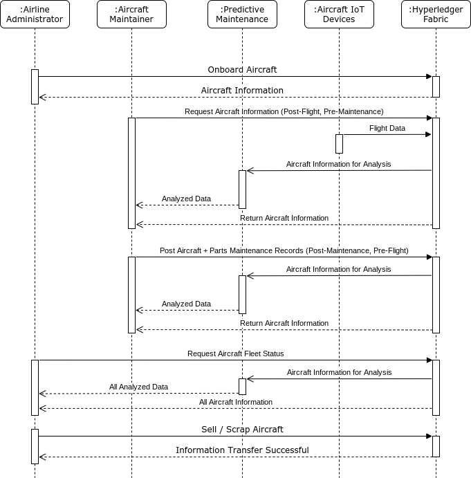

* Projet Blockchain GL5 - Plateforme de suivi des avions par les compagnies aériennes en utilisant Hyperledger Fabric

* Lien de la présentation : https://docs.google.com/presentation/d/1J84Cpno0GSwtXYVDmBdaTpJAixA8BIhAaV104LKs7kY/edit#slide=id.p

# Plateforme de suivi des avions

* Application distribuée développée dont l'objectif est de mettre en place une plateforme de tracabilité des avions et leur maintance et ceci en utilisant la technologie hyperledgerFabric
* Equipe : Souheil Ben Slama - Mohamed Aziz Ammari - Marouane Mahou - Chaima Ben Ghanem - Amal Abidi
* GL5

## Description

L'industrie aérospatiale possède une chaîne d'approvisionnement vaste et complexe impliquant des centaines, voire des milliers d'entreprises et des millions de pièces. L'ensemble de la chaîne d'approvisionnement doit respecter des réglementations et des procédures spécifiques spécifiées par les organes directeurs des gouvernements et d'autres organisations. Les nombreuses facettes de la chaîne d'approvisionnement peuvent être observées dans les différentes phases de développement et de déploiement des aéronefs - approvisionnement en pièces, assemblage des aéronefs, certification, livraison, maintenance et fin de vie.

Ce projet ne cherche pas à fournir une solution globale pour l'ensemble de la chaîne d'approvisionnement aérospatiale, mais plutôt une solution ciblée pour les compagnies aériennes et le cycle de maintenance, de réparation et de révision (MRO) requis pour les avions achetés. L'objectif est de numériser les dossiers de maintenance et de provenance des pièces de manière à accroître la confiance lors de la vente de l'avion, à économiser de l'argent grâce à un processus plus rationalisé et, surtout, à accroître la sécurité du transport aérien.

La solution proposée espère résoudre le problème le plus paradoxal de la chaîne d'approvisionnement : comment augmenter la fiabilité, la sécurité et la qualité tout en diminuant les coûts.

### Intérêts et objectifs

Pour une compagnie aérienne typique comme Air Canada, Delta, KLM, etc., un avion suit le cycle illustré dans la figure ci-dessous : 

  

L'avion est livré et le cycle de maintenance et de vols se déroule jusqu'à ce qu'il soit déterminé qu'il sera vendu ou mis au rebut. Au cours des procédures MRO, les pièces peuvent être fournies comme neuves par des fournisseurs externes ou elles peuvent être récupérées à partir d'un avion mis au rebut. Ces pièces sont encore utilisables car elles n'ont pas dépassé leur seuil d'heures de vol.

Le problème est que les dossiers de maintenance sont souvent encore suivis sur papier, et le dossier d'un avion peut être constitué de classeurs remplis de diverses informations. De plus, les pièces qui ont été utilisées dans d'autres aéronefs peuvent ne pas avoir la bonne provenance et manquer d'informations critiques concernant leur durée de vie. Dans l'ensemble, les informations sont plus difficiles à trouver et à suivre, ce qui met la vie des clients en jeu et introduit des inefficacités dans un plan d'horaires de vol très soigneusement optimisé.

### L'architecture de la solution

La solution proposée exploite la technologie blockchain via Hyperledger Fabric pour le suivi et le partage d'informations au sein d'une compagnie aérienne et avec d'autres compagnies aériennes lorsqu'un avion doit être vendu. Les enregistrements de maintenance et de provenance des pièces peuvent être facilement stockés sur le réseau blockchain par les fournisseurs MRO via des mises à jour manuelles et l'intégration d'appareils IoT.

Les appareils Internet des objets (IoT) permettent de générer automatiquement des enregistrements de vol pour l'avion et ses pièces associées. Les appareils peuvent suivre la température et l'accélération pour suivre les diverses contraintes et conditions et noter si des conditions anormales ont été rencontrées. Ces informations seraient stockées sur la blockchain pour fournir un enregistrement immuable de l'historique d'un avion ou d'une pièce.

Cependant, les appareils IoT fournissent souvent d'énormes quantités d'informations et l'analyse des informations pour les modèles dangereux est difficile. En plus de la blockchain et de la technologie IoT, la solution proposée comprendrait un algorithme d'apprentissage automatique pour la maintenance prédictive. En accédant aux dossiers de maintenance et aux données IoT de plusieurs aéronefs, l'algorithme serait en mesure d'alerter les responsables de la maintenance des problèmes éventuels ou des tendances notables de l'état des aéronefs.

## Technical Details (PoC)

La section traite des paramètres techniques utilisés dans Hyperledger Fabric, l'API Expresss et le frontal React.

### L'architecture

**Hyperledger Fabric**  
Blockchain en tant que backend où les informations sur les avions et les pièces peuvent être stockées selon les données et les paramètres spécifiés ci-dessous. L'implémentation actuelle n'utilise qu'un seul channel, utilisateur et administrateur pour la preuve de concept. Les futures implémentations utiliseraient différents canaux, utilisateurs, administrateurs et stockage de données privées en fonction de l'échelle et du nombre d'entreprises.

**Express API**  
Express.js est utilisé comme API pour se connecter à une instance basée sur le cloud de Hyperledger Fabric. Dans ce cas, l'instance est basée sur une machine virtuelle Google Cloud. La future implémentation inclurait plusieurs API réparties sur différents nœuds/clients. De plus, l'instance basée sur le cloud serait très probablement déplacée d'une machine virtuelle vers un cluster kubernetes basé sur le cloud.

**React**  
React est le front-end de démonstration pour un point de connexion unique pendant la phase PoC. De plus, le site doit être adapté aux mobiles pour que les responsables puissent l'utiliser facilement au travail sans avoir besoin d'un gros appareil. À l'avenir, les entreprises pourraient créer leurs propres applications frontales pour s'interfacer avec différents points de terminaison API.

### Modélisation

Le diagramme suivant montre les 5 différents types d'interactions pour le PoC.

1. L'administrateur de la compagnie aérienne embarque un nouvel avion du fabricant.
1. Le responsable de la maintenance demande des informations sur l'avion après un vol et avant la maintenance.
1. Le responsable de la maintenance soumet les informations de maintenance de l'aéronef avant un vol.
1. L'administrateur demande des informations sur l'ensemble de la flotte.
1. L'administrateur vend ou met au rebut l'avion.

_Remarque : les appareils IoT et la maintenance prédictive ne sont pas implémentés dans PoC_

Des éléments de modélisation supplémentaires peuvent être trouvés dans le dossier "documentation":

- [User stories](./documentation/userStories.md)
- [Diagramme de classes ](./documentation/classDiagram.png)

### Data/Parameters

_Stored in Hyperledger Fabric_

**Aircraft Object**

| Parameter             | Type                                                                                         | Description                                                                                                                           |
| --------------------- | -------------------------------------------------------------------------------------------- | ------------------------------------------------------------------------------------------------------------------------------------- |
| `description`         | `{string aircraft, string tailNumber}`                                                       | Pour idéntifier l'avion spécifique                                                                                                    |
| `maintenanceSchedule` | `[{string type, number lastCompletedDate, number lastCompletedHours, number maxHours}, ...]` | Un tableau qui suit l'état actuel des maintenances                                                                                    |
| `partsList`           | `[string partID, ...]`                                                                       | Un tableau qui suit les parties qui sont actuellement dans l'avion                                                                    |
| `flightHours`         | `number`                                                                                     | Numéro de suivi des heures totales pour l'avion                                                                                       |
| `owner`               | `[{string company, number purchaseDate, number soldDate}, ...]`                              | Un tableau suivant l'historique d'achat des avions                                                                                    |
| `maintainers`         | `[string username, ...]`                                                                     | Un tableau qui contient la liste des teneurs de l'avion (qui ont le droit de modifier les informations de maintenance pour les avions |
| `maintenanceReports`  | `[{number date, string type, string notes, object partsReplaced}, ...]`                      | Un tableau contenant les différents rapports d'inspection                                                                             |

**Part Object**

| Parameter      | Type                                                                      | Description                                                                                                                           |
| -------------- | ------------------------------------------------------------------------- | ------------------------------------------------------------------------------------------------------------------------------------- |
| `description`  | `{string id, string name}`                                                | Le numéro fait référence au numéro de pièce général, en particulier pour les pièces remplaçables, le nom est un nom écrit de la pièce |
| `totalHours`   | `number`                                                                  | Suivi du nombre total d'heures de vol pour la pièce                                                                                   |
| `maximumHours` | `number`                                                                  | Heures de vol maximum pour la partie                                                                                                  |
| `history`      | `[{string tailNumber, number hours, number onDate, number offDate}, ...]` | Tableau montrant l'historique de la pièce, le dernier index est le plus récent                                                        |

**User Object**

| Parameter  | Type                | Description                                |
| ---------- | ------------------- | ------------------------------------------ |
| `username` | `string`            | nom d'utilisateur stocké                   |
| `password` | `string`            | Mot de passe hashé                         |
| `type`     | `string`            | Peut être un admin ou un mainteneur        |
| `company`  | `string`            | La compagnie que l'utilisateur             |
| `aircraft` | `[tailNumber, ...]` | Un tableau de tailNumber que l'utilisateur |

### Functions

_Functions for managing data and interacting with data from outside Hyperledger_

**Chaincode Functions**

| Function Name        | Input                                                                      | Output              | Restricted                  | Details                                                                                                                                                                                          |
| -------------------- | -------------------------------------------------------------------------- | ------------------- | --------------------------- | ------------------------------------------------------------------------------------------------------------------------------------------------------------------------------------------------ |
| `registerUser`       | string `username`, string `password`, string `type`, string `company`      | bool `success`      | Admin + Maintainer          | Crée un profil d'utilisateur pour l'administrateur ou le responsable, le nom d'utilisateur et le mot de passe hachés sont stockés dans la blockchain, échoue si le nom d'utilisateur existe déjà |
| `checkUser`          | string `username`, string `password`, string `type`, string `company`      | object `user`       | Admin + Maintainer          | Vérifie le nom d'utilisateur et le mot de passe par rapport aux informations de la blockchain et renvoie un booléen                                                                              |
| `registerAircraft`   | string `aircraft`, string `tailNumber`, string `company`                   | string `tailNumber` | Admin                       | Enregistrez un nouvel avion et créez l'objet avion                                                                                                                                               |
| `assignAircraft`     | string `username`, string `tailNumber`, string `company`                   | bool `success`      | Admin                       | Affectez le mainteneur à l'avion afin qu'il ait accès aux données                                                                                                                                |
| `getAircraft`        | string `tailNumber`                                                        | object `aircraft`   | Admin + Assigned Maintainer | Obtient toutes les informations pour un avion spécifique dans le format décrit ci-dessus                                                                                                         |
| `newPart`            | object `part`                                                              | string `partID`     | Maintainer                  | Register new part in system                                                                                                                                                                      |
| `getPart`            | string `partID`                                                            | object `part`       | Admin + Assigned Maintainer | Obtient toutes les informations pour une pièce spécifique dans le format décrit ci-dessus                                                                                                        |
| `updateFlightHours`  | string `tailNumber`, number `hours`                                        | number `hours`      | Assigned Maintainer         | Met à jour les heures de vol de l'avion et de ses pièces associées (à l'avenir, cela sera appelé par les appareils IoT)                                                                          |
| `performMaintenance` | string `tailNumber`, string `type`, string `notes`, object `replacedParts` | object `aircraft`   | Assigned Maintainer         | Stocke le dossier de maintenance pour l'avion spécifié                                                                                                                                           |
| `replaceParts`       | string `tailNumber`, object `replacedParts`                                | bool `success`      | Assigned Maintainer         | Met à jour les objets de l'avion et de la pièce, si une nouvelle pièce est entrée, cela crée une nouvelle entrée                                                                                 |
| `sellAircraft`       | string `tailNumber`, string `company`                                      | bool `success`      | Admin                       | Transfers ownership of aircraft to new account, and removes maintainers access                                                                                                                   |
| `getMaintainers`     | string `company`                                                           | array `maintainers` | Admin                       | Renvoie une liste de tous les mainteneurs d'une entreprise spécifique                                                                                                                            |
| `getCompanies`       |                                                                            | array `companies`   | Admin + Maintainer          | Renvoie une liste de toutes les entreprises                                                                                                                                                      |

**API Endpoints**

| Endpoint    | Type  | Chaincode Function                    | Returns               |
| ----------- | ----- | ------------------------------------- | --------------------- |
| `\`         | GET   | `getCompanies`                        | array `companies`     |
| `\login`    | POST  | `registerUser`                        | bool `success`        |
| `\login`    | POST  | `checkUser`                           | string `jsonwebtoken` |
| `\aircraft` | POST  | `registerAircraft`                    | object `aircraft`     |
| `\aircraft` | GET   | `getAircraft`                         | object `aircraft`     |
| `\aircraft` | PATCH | `performMaintenance` + `replaceParts` | object `aircraft`     |
| `\part`     | GET   | `getPart`                             | object `part`         |
| `\part`     | POST  | `newPart`                             | string `partID`       |
| `\flight`   | POST  | `updateFlightHours`                   | number `hours`        |
| `\admin`    | POST  | `assignAircraft`                      | bool `success`        |
| `\admin`    | PATCH | `sellAircraft`                        | bool `success`        |
| `\admin`    | GET   | `getMaintainers`                      | array `maintainers`   |

## Goals + Tasks
- [x] Hyperledger Fabric (planning de maintenance + provenance des pièces)
   - [x] Logique complète
   - [x] Stockage de plus de paramètres - si nécessaire
- [x] API Express
   - [x] API de base
   - [x] validation de l'utilisateur à l'aide de JWT
- [ ] React frontal
   - [x] Cadre de base
   - [x] Site adapté aux mobiles
   - [x] Indicateur d'état du front-end lors de la connexion à l'API (voir s'il est toujours actif)
   - [x] Interactions avec l'administrateur
   - [x] Interactions avec le responsable
   - [ ] Test complet du système en utilisant uniquement le frontal
- [x] ~~Cas de test pour le code blockchain et l'API~~ _(non implémenté dans PoC)_
- [x] CI/CD
   - [x] pour le déploiement du site
   - [x] ~~pour les cas de test~~ _(non implémenté dans PoC)_

## Notes

- La validation avec des jetons Web JSON n'est pas une bonne pratique de sécurité. JWT a été utilisé pour faciliter la mise en œuvre de PoC.

## Resources

- [Maintenance record standards](https://www.icao.int/safety/airnavigation/OPS/airworthiness/Pages/EAMR.aspx)
- [Maintenance checks](https://en.wikipedia.org/wiki/Aircraft_maintenance_checks)
- [Installation instructions for Hyperledger](./documentation/chaincodeInstallation.md)
- [Sample chaincode calls](./chaincode/javascript/commands.md)
- [Github pages + React](https://github.com/gitname/react-gh-pages)
- [Persistent server - nohup yarn start &](https://stackoverflow.com/questions/4018154/how-do-i-run-a-node-js-app-as-a-background-service)
